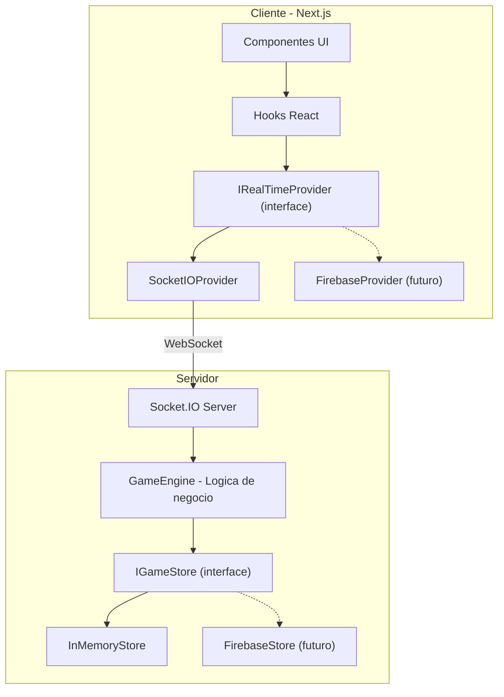

# Prompts de Execucao - Sistema de Quiz em Tempo Real

Baseado em [planejamento_implementacao_quiz_tempo_real.md](planejamento_implementacao_quiz_tempo_real.md) e [especificacao_tecnica_quiz_tempo_real.md](especificacao_tecnica_quiz_tempo_real.md).

**Decisao arquitetural:** Implementar primeiro com WebSocket (Socket.IO), mantendo uma camada de abstracao (Provider Pattern) que permita trocar o transporte para Firebase Realtime Database sem alterar componentes de UI ou logica de negocio.




---

## Fase 1 -- Fundacao (Prompts 1 a 3)

### Prompt 1 -- Setup do Projeto Next.js + Tailwind + Shadcn

**Escopo:** Criar o projeto base com todas as dependencias de UI configuradas.

**Instrucoes de execucao:**

- Inicializar projeto Next.js (App Router) com TypeScript
- Configurar TailwindCSS
- Instalar e configurar Shadcn UI (componentes: Button, Input, Card, Dialog, Badge, Separator, Toast)
- Criar estrutura de pastas:

```
src/
  app/              # Rotas Next.js (App Router)
  components/       # Componentes reutilizaveis
  hooks/            # Custom hooks
  lib/              # Utilitarios e helpers
  types/            # Tipos TypeScript compartilhados
  providers/        # Implementacoes dos providers de real-time
  server/           # Logica do servidor (GameEngine, Store)
```

- Configurar path aliases (`@/`)
- Criar layout base (`app/layout.tsx`) com fonte e metadata
- Criar pagina inicial (`app/page.tsx`) com navegacao para "Criar Sala" e "Entrar em Sala"

**Criterios de aceite:**

- `npm run dev` funciona sem erros
- Pagina inicial renderiza com componentes Shadcn
- Estrutura de pastas completa criada

---

### Prompt 2 -- Tipos TypeScript + Camada de Abstracao (Provider Pattern)

**Escopo:** Definir todos os tipos do dominio e as interfaces de abstracao que permitirao trocar WebSocket por Firebase no futuro.

**Instrucoes de execucao:**

- Criar `types/quiz.ts` com todos os tipos do dominio:

```typescript
export type RoomStatus = 'waiting' | 'playing' | 'result' | 'finished';

export interface Room {
  id: string;
  code: string;
  status: RoomStatus;
  hostId: string;
  currentQuestionIndex: number;
  questionStartTimestamp: number | null;
  participants: Record<string, Participant>;
  questions: Question[];
  answers: Record<string, Record<string, Answer>>;
}

export interface Participant {
  id: string;
  name: string;
  totalScore: number;
  totalResponseTime: number;
  questionsAnswered: number;
  joinedAt: number;
  connected: boolean;
}

export interface Question {
  text: string;
  options: [string, string, string, string];
  correctOptionIndex: number;
}

export interface Answer {
  participantId: string;
  optionIndex: number;
  timestamp: number;
  responseTime: number;
  score: number;
}
```

- Criar `types/events.ts` com os eventos de comunicacao cliente-servidor:

```typescript
export interface ClientEvents {
  'room:create': (data: { questions: Question[] }) => void;
  'room:join': (data: { code: string; name: string }) => void;
  'game:start': () => void;
  'game:next-question': () => void;
  'game:end': () => void;
  'answer:submit': (data: { optionIndex: number }) => void;
}

export interface ServerEvents {
  'room:created': (data: { roomId: string; code: string }) => void;
  'room:joined': (data: { participantId: string }) => void;
  'room:state': (data: Room) => void;
  'room:participant-joined': (data: Participant) => void;
  'game:status-changed': (data: { status: RoomStatus; questionIndex: number; timestamp: number | null }) => void;
  'game:answer-count': (data: { count: number; total: number }) => void;
  'answer:result': (data: { correct: boolean; score: number; correctIndex: number }) => void;
  'ranking:update': (data: Participant[]) => void;
  'error': (data: { message: string; code: string }) => void;
}
```

- Criar `providers/IRealTimeProvider.ts` -- interface abstrata do lado do cliente:

```typescript
export interface IRealTimeProvider {
  connect(roomId: string, role: 'host' | 'participant'): void;
  disconnect(): void;
  
  createRoom(questions: Question[]): Promise<{ roomId: string; code: string }>;
  joinRoom(code: string, name: string): Promise<{ participantId: string }>;
  
  startGame(): void;
  nextQuestion(): void;
  endGame(): void;
  submitAnswer(optionIndex: number): void;
  
  onRoomState(callback: (room: Room) => void): () => void;
  onParticipantJoined(callback: (participant: Participant) => void): () => void;
  onGameStatusChanged(callback: (data: GameStatusData) => void): () => void;
  onAnswerCount(callback: (data: AnswerCountData) => void): () => void;
  onAnswerResult(callback: (data: AnswerResultData) => void): () => void;
  onRankingUpdate(callback: (participants: Participant[]) => void): () => void;
  onError(callback: (error: ErrorData) => void): () => void;
}
```

- Criar `server/IGameStore.ts` -- interface abstrata do lado do servidor:

```typescript
export interface IGameStore {
  createRoom(room: Room): Promise<void>;
  getRoom(roomId: string): Promise<Room | null>;
  getRoomByCode(code: string): Promise<Room | null>;
  updateRoom(roomId: string, updates: Partial<Room>): Promise<void>;
  addParticipant(roomId: string, participant: Participant): Promise<void>;
  addAnswer(roomId: string, questionIndex: number, answer: Answer): Promise<void>;
  updateParticipantScore(roomId: string, participantId: string, scoreIncrement: number, responseTime: number): Promise<void>;
  deleteRoom(roomId: string): Promise<void>;
}
```

**Criterios de aceite:**

- Todos os tipos compilam sem erros
- Interfaces `IRealTimeProvider` e `IGameStore` cobrem todos os fluxos do jogo
- Nenhuma referencia direta a Socket.IO ou Firebase nos tipos/interfaces

---

### Prompt 3 -- Servidor Socket.IO + InMemoryStore + GameEngine

**Escopo:** Implementar o servidor WebSocket com Socket.IO, o armazenamento em memoria e o motor de regras de negocio.

**Instrucoes de execucao:**

- Instalar `socket.io` e `socket.io-client`
- Criar custom server Next.js (`server.ts`) que integra Socket.IO ao servidor HTTP do Next
- Criar `server/InMemoryStore.ts` implementando `IGameStore`:
  - Armazena salas em um `Map<string, Room>`
  - Todas as operacoes sao sincronas internamente (wrappadas em Promise)
- Criar `server/GameEngine.ts` com toda a logica de negocio:
  - `createRoom(questions)` -- gera codigo unico de 6 caracteres, cria sala com status `waiting`
  - `joinRoom(roomId, name)` -- valida nome unico, valida status `waiting`, registra participante
  - `startGame(roomId, hostId)` -- valida que e o host, muda status para `playing`, define `questionStartTimestamp` com `Date.now()`
  - `submitAnswer(roomId, participantId, questionIndex, optionIndex)` -- valida duplicata, valida tempo (120s), calcula pontuacao, atualiza score total
  - `nextQuestion(roomId, hostId)` -- valida que e o host, incrementa index, define novo timestamp, muda status
  - `endGame(roomId, hostId)` -- muda status para `finished`
  - `getRanking(roomId)` -- retorna participantes ordenados pelos criterios de desempate
- Criar `server/SocketHandler.ts` que conecta os eventos Socket.IO ao GameEngine:
  - Mapeia cada evento de `ClientEvents` para a chamada correspondente no GameEngine
  - Emite eventos de `ServerEvents` para os clientes corretos (sala, individual)
  - Usa salas do Socket.IO (`socket.join(roomId)`) para broadcast

**Formula de pontuacao (apenas respostas corretas):**

```typescript
const responseTime = Date.now() - questionStartTimestamp;
const tempoRestante = Math.max(0, 120000 - responseTime);
const score = Math.round(120 * (tempoRestante / 120000));
```

**Criterios de aceite:**

- Servidor Socket.IO sobe junto com `npm run dev`
- GameEngine implementa todas as regras de negocio da especificacao
- InMemoryStore armazena e recupera dados corretamente
- Eventos sao emitidos para os clientes corretos via salas Socket.IO

---

## Fase 2 -- Fluxo Base (Prompts 4 a 6)

### Prompt 4 -- Criacao de Sala (Fluxo do Host)

**Escopo:** Implementar as telas de criacao de sala e lobby do Host.

**Instrucoes de execucao:**

- Criar `providers/SocketIOProvider.ts` implementando `IRealTimeProvider` (funcionalidade parcial: `createRoom`, `connect`, `onRoomState`, `onParticipantJoined`)
- Criar `providers/RealTimeContext.tsx` -- React Context que fornece a instancia do provider
- Criar pagina `app/host/create/page.tsx` com formulario:
  - Adicionar perguntas (enunciado + 4 alternativas + selecionar correta)
  - Validar que cada pergunta tem exatamente 4 alternativas e 1 correta
  - Reordenar perguntas (botoes mover cima/baixo)
  - Minimo de 1 pergunta para criar sala
  - Botao "Criar Sala" envia via provider
- Gerar e armazenar `hostId` (UUID) no localStorage
- Apos criacao, redirecionar para `app/host/[roomId]/page.tsx` (lobby)
- No lobby:
  - Exibir codigo da sala em destaque (copiavel)
  - Lista de participantes atualizada em tempo real via `onParticipantJoined`
  - Botao "Iniciar Jogo" (sem funcionalidade neste prompt)

**Criterios de aceite:**

- Host cria sala com perguntas validas
- Codigo da sala exibido e copiavel
- Lobby mostra participantes em tempo real
- Dados persistem no InMemoryStore do servidor

---

### Prompt 5 -- Entrada de Participante na Sala

**Escopo:** Implementar o fluxo completo de entrada do participante.

**Instrucoes de execucao:**

- Estender `SocketIOProvider` com: `joinRoom`, `onError`
- Criar pagina `app/join/page.tsx` com formulario:
  - Campo: codigo da sala (6 caracteres)
  - Campo: nome do participante
  - Validacao client-side: campos obrigatorios
  - Ao enviar, chama `provider.joinRoom(code, name)`
  - Tratar erros do servidor: sala nao encontrada, nome duplicado, sala ja iniciada
- Gerar `participantId` (UUID) e salvar no localStorage
- Redirecionar para `app/play/[roomId]/page.tsx` (tela de espera)
- Tela de espera:
  - Mensagem "Aguardando o Host iniciar o jogo..."
  - Lista de participantes atualizada em tempo real
  - Nome do participante atual destacado na lista

**Criterios de aceite:**

- Participante entra na sala com nome unico
- Erros de validacao exibidos corretamente (nome duplicado, sala inexistente, sala ja iniciada)
- Tela de espera sincronizada em tempo real
- Host ve o participante aparecer no lobby instantaneamente

---

### Prompt 6 -- Hooks de Sincronizacao via Provider

**Escopo:** Criar hooks reutilizaveis que abstraem a comunicacao com o provider.

**Instrucoes de execucao:**

- Criar `hooks/useRealTime.ts` -- retorna a instancia do provider do contexto
- Criar `hooks/useRoom.ts` -- escuta `onRoomState`, retorna `{ room, loading, error }`
- Criar `hooks/useParticipants.ts` -- derivado do room state, retorna lista de participantes
- Criar `hooks/useGameState.ts` -- derivado do room state, retorna `{ status, currentQuestionIndex, questionStartTimestamp }`
- Criar `hooks/useTimer.ts` -- recebe `questionStartTimestamp`, retorna `{ timeLeft, isExpired, progress }`, atualiza a cada 100ms via `requestAnimationFrame`
- Criar `hooks/useAnswerCount.ts` -- escuta `onAnswerCount`, retorna `{ count, total }`
- Todos os hooks:
  - Fazem cleanup dos listeners no unmount
  - Retornam estado de loading e error
  - Sao agnosticos ao provider (funcionam com Socket.IO ou Firebase)

**Criterios de aceite:**

- Hooks compilam e funcionam com `SocketIOProvider`
- Nenhum hook referencia Socket.IO diretamente
- Cleanup executado corretamente (sem memory leaks)
- `useTimer` calcula countdown com base no timestamp do servidor

---

## Fase 3 -- Execucao do Jogo (Prompts 7 a 11)

### Prompt 7 -- Maquina de Estados + Inicio do Jogo

**Escopo:** Implementar as transicoes de estado da sala e conectar ao fluxo de UI.

**Instrucoes de execucao:**

- Estender `SocketIOProvider` com: `startGame`, `nextQuestion`, `endGame`, `onGameStatusChanged`
- Transicoes no GameEngine (ja implementado no Prompt 3, agora conectar ao frontend):
  - `waiting` -> `playing`: Host clica "Iniciar Jogo"
  - `playing` -> `result`: servidor detecta timeout (120s) ou todos responderam
  - `result` -> `playing`: Host clica "Proxima Pergunta"
  - `result` -> `finished`: ultima pergunta concluida ou Host clica "Encerrar"
- No lobby do Host:
  - Botao "Iniciar Jogo" agora funcional -- chama `provider.startGame()`
  - Desabilitado se < 1 participante
- No `app/play/[roomId]/page.tsx`:
  - Reagir ao `status` via `useGameState`:
    - `waiting` -> tela de espera
    - `playing` -> tela de pergunta (proximo prompt)
    - `result` -> tela de resultado (prompt 11)
    - `finished` -> tela de ranking final (prompt 11)
- No `app/host/[roomId]/page.tsx`:
  - Mesma logica de reacao ao estado, com controles do Host

**Criterios de aceite:**

- Host inicia o jogo e todos os participantes veem a transicao instantaneamente
- Timestamp do servidor registrado ao iniciar cada pergunta
- Entrada bloqueada quando status != `waiting`
- UI reage automaticamente a cada mudanca de estado

---

### Prompt 8 -- Tela de Pergunta + Timer Visual

**Escopo:** Implementar a exibicao da pergunta e o timer sincronizado.

**Instrucoes de execucao:**

- Criar componente `components/QuestionCard.tsx`:
  - Exibe enunciado da pergunta
  - Exibe 4 alternativas como botoes com cores distintas (vermelho, azul, amarelo, verde -- estilo Kahoot)
  - Props: `question`, `onAnswer`, `disabled`, `selectedIndex`
- Criar componente `components/Timer.tsx`:
  - Barra de progresso + numero de segundos restantes
  - Usa `useTimer` hook (baseado no `questionStartTimestamp` do servidor)
  - Muda de cor: verde (> 30s) -> amarelo (30s-10s) -> vermelho (< 10s)
  - Pisca nos ultimos 5 segundos
- No `app/play/[roomId]/page.tsx` quando status == `playing`:
  - Renderizar `QuestionCard` + `Timer`
  - Ao expirar timer, desabilitar alternativas e exibir "Tempo esgotado!"
- No `app/host/[roomId]/page.tsx` quando status == `playing`:
  - Exibir pergunta (somente enunciado, sem resposta correta visivel)
  - Exibir timer
  - Exibir contador "X de Y responderam" via `useAnswerCount`
  - Botao "Encerrar Pergunta" (forca transicao para `result`)

**Criterios de aceite:**

- Pergunta e alternativas renderizam corretamente
- Timer sincronizado via timestamp do servidor (nao relogio local)
- Cores mudam conforme urgencia
- Host ve contagem de respostas em tempo real

---

### Prompt 9 -- Envio de Resposta + Validacao Server-side

**Escopo:** Implementar envio, validacao e bloqueio de respostas.

**Instrucoes de execucao:**

- Estender `SocketIOProvider` com: `submitAnswer`, `onAnswerResult`
- No `QuestionCard`, ao clicar uma alternativa:
  - Chamar `provider.submitAnswer(optionIndex)`
  - Desabilitar todas as alternativas imediatamente (otimista)
  - Destacar a alternativa selecionada
  - Exibir estado "Aguardando resultado..."
- No GameEngine (server-side), ao receber `answer:submit`:
  1. Verificar se participante ja respondeu esta pergunta -> rejeitar com erro
  2. Calcular responseTime = `Date.now()` - `questionStartTimestamp`
  3. Se responseTime > 120000ms -> rejeitar com erro "Tempo esgotado"
  4. Verificar se resposta esta correta
  5. Calcular score (formula do Prompt 3)
  6. Salvar resposta no store
  7. Atualizar pontuacao total do participante
  8. Emitir `answer:result` para o participante (correto/incorreto, score, indice correto)
  9. Emitir `game:answer-count` para a sala inteira
  10. Se todos responderam, emitir transicao para `result`

**Criterios de aceite:**

- Resposta registrada corretamente no servidor
- Duplicata bloqueada no servidor (nao apenas no cliente)
- Resposta fora do tempo rejeitada pelo servidor
- Pontuacao calculada corretamente: `score = Math.round(120 * (tempoRestante / 120000))`
- Participante recebe feedback individual (acertou/errou)
- Host ve contador atualizar em tempo real

---

### Prompt 10 -- Pontuacao + Ranking Dinamico

**Escopo:** Implementar logica de ranking e componente visual.

**Instrucoes de execucao:**

- No GameEngine, implementar `getRanking(roomId)`:
  - Ordenar participantes por: (1) maior `totalScore`, (2) menor tempo medio (`totalResponseTime / questionsAnswered`), (3) menor `joinedAt`
  - Retornar lista ordenada com posicao
- Emitir `ranking:update` para a sala apos cada resposta processada
- Estender `SocketIOProvider` com: `onRankingUpdate`
- Criar `hooks/useRanking.ts` -- escuta `onRankingUpdate`, retorna lista ordenada
- Criar componente `components/Ranking.tsx`:
  - Recebe lista ordenada de participantes
  - Exibe posicao, nome, pontuacao total
  - Destaque visual para top 3 (ouro, prata, bronze com icones/cores)
  - Destaque para o participante atual (se for a tela do participante)
- Criar componente `components/FinalRanking.tsx`:
  - Versao expandida para tela final
  - Podio visual para top 3
  - Destaque claro para o vencedor

**Criterios de aceite:**

- Ranking ordena corretamente pelos 3 criterios de desempate
- Atualiza em tempo real apos cada resposta
- Top 3 com destaque visual diferenciado
- Componente reutilizavel entre tela de resultado e tela final

---

### Prompt 11 -- Tela de Resultado da Rodada + Tela Final

**Escopo:** Implementar as telas de resultado parcial e ranking final.

**Instrucoes de execucao:**

- Quando status == `result` (tela do **Participante**):
  - Exibir se acertou ou errou (icone + cor)
  - Destacar a alternativa correta em verde
  - Se errou, destacar a alternativa escolhida em vermelho
  - Exibir pontuacao obtida na rodada
  - Exibir componente `Ranking` com posicao atualizada
  - Mensagem "Aguardando proxima pergunta..."
- Quando status == `result` (tela do **Host**):
  - Exibir resposta correta destacada
  - Exibir distribuicao de respostas (grafico de barras simples: quantos escolheram cada alternativa)
  - Exibir componente `Ranking`
  - Botao "Proxima Pergunta": chama `provider.nextQuestion()`
  - Se for a ultima pergunta: botao muda para "Ver Ranking Final" -> chama `provider.endGame()`
- Quando status == `finished`:
  - **Participante e Host:** Exibir `FinalRanking` com podio e vencedor
  - Botao "Voltar ao Inicio" para ambos

**Criterios de aceite:**

- Resultado da rodada exibido corretamente para participantes e host
- Distribuicao de respostas visivel para o Host
- Host avanca o jogo e todos veem a transicao
- Ranking final com destaque claro do vencedor

---

## Fase 4 -- Estabilidade e Polimento (Prompts 12 a 14)

### Prompt 12 -- Tratamento de Desconexao

**Escopo:** Garantir resiliencia a desconexoes temporarias.

**Instrucoes de execucao:**

- No servidor Socket.IO:
  - Ao detectar `disconnect`, marcar participante como `connected: false` (nao remover)
  - Emitir `room:participant-disconnected` para a sala
  - Ao reconectar (mesmo `participantId` via localStorage), restaurar:
    - Marcar `connected: true`
    - Enviar estado atual completo da sala via `room:state`
  - Se o Host desconectar: manter sala ativa, exibir aviso para participantes
- No cliente:
  - Detectar desconexao via eventos do Socket.IO (`connect_error`, `disconnect`)
  - Exibir overlay "Reconectando..." com spinner
  - Tentar reconexao automatica (Socket.IO ja faz, mas adicionar feedback visual)
  - Ao reconectar, reenviar identificacao (roomId + participantId/hostId do localStorage)
- Pontuacao acumulada nunca deve ser perdida (armazenada no servidor)

**Criterios de aceite:**

- Participante reconecta e ve o estado atual do jogo
- Pontuacao preservada apos desconexao
- Indicador visual de "Reconectando..." durante desconexao
- Outros participantes veem indicador de quem esta desconectado

---

### Prompt 13 -- Feedback Visual e Animacoes

**Escopo:** Melhorar a experiencia visual com animacoes e transicoes.

**Instrucoes de execucao:**

- Instalar `framer-motion`
- Adicionar animacoes:
  - Transicao entre telas/estados (fade + slide)
  - Entrada das alternativas (staggered, uma por uma)
  - Feedback ao selecionar alternativa (pulse + cor)
  - Timer com urgencia visual (ja parcialmente feito no Prompt 8, refinar)
  - Confetti ao exibir vencedor final (`canvas-confetti`)
  - Animacao de mudanca de posicao no ranking (layout animation do framer-motion)
- Sons opcionais (com toggle para ativar/desativar):
  - Som ao selecionar resposta
  - Tick nos ultimos 5 segundos
  - Som de vitoria/derrota

**Criterios de aceite:**

- Transicoes suaves entre todos os estados
- Confetti na tela final
- Ranking anima mudancas de posicao
- Performance nao degradada (60fps)

---

### Prompt 14 -- Tratamento de Erros e Edge Cases

**Escopo:** Cobrir todos os cenarios de erro e borda.

**Instrucoes de execucao:**

- Tratamento de erros:
  - Sala nao encontrada (codigo invalido) -> mensagem clara no formulario
  - Sala ja iniciada -> "Esta sala ja esta em andamento"
  - Servidor offline/indisponivel -> tela de erro com retry
  - Host desconecta durante o jogo -> aviso para participantes
  - Participante acessa URL direta sem estar registrado -> redirecionar para `/join`
  - Navegador fecha e reabre -> tentar restaurar sessao via localStorage
- Criar componente `components/ErrorBoundary.tsx`
- Criar pagina `app/not-found.tsx` customizada
- Adicionar toasts (Shadcn Toast) para feedback de acoes e erros inline
- Validacao de todos os formularios com mensagens claras
- Timeout no servidor: auto-transicao para `result` quando timer expira (nao depender do cliente)

**Criterios de aceite:**

- Nenhum erro nao tratado visivel ao usuario
- Mensagens de erro claras e amigaveis em portugues
- Servidor faz timeout automatico (nao depende do cliente)
- Sessao restauravel via localStorage

---

## Fase 5 -- Migracao para Firebase (Prompts 15 a 16)

### Prompt 15 -- Setup Firebase + Provider Firebase

**Escopo:** Implementar o provider Firebase e o store Firebase, substituindo WebSocket.

**Instrucoes de execucao:**

- Instalar `firebase` SDK
- Criar `lib/firebase.ts` com inicializacao (variaveis de ambiente)
- Criar `.env.local.example` com variaveis necessarias
- Criar `providers/FirebaseProvider.ts` implementando `IRealTimeProvider`:
  - Usar `firebase.database().ref()` com listeners `on('value')` para substituir eventos Socket.IO
  - Manter a mesma interface que `SocketIOProvider`
  - Usar `ServerValue.TIMESTAMP` para timestamps
- Criar `server/FirebaseStore.ts` implementando `IGameStore`:
  - Substituir `InMemoryStore` por Firebase Realtime Database
  - Manter a mesma interface
- Atualizar `RealTimeContext.tsx` para aceitar configuracao de qual provider usar (via variavel de ambiente `NEXT_PUBLIC_PROVIDER=websocket|firebase`)
- Nenhuma alteracao nos componentes de UI, hooks ou GameEngine

**Criterios de aceite:**

- Aplicacao funciona identicamente com `NEXT_PUBLIC_PROVIDER=firebase`
- Nenhum componente de UI foi alterado
- Hooks continuam funcionando sem mudanca
- Dados persistem no Firebase Realtime Database

---

### Prompt 16 -- Cloud Functions + Regras de Seguranca

**Escopo:** Mover validacao critica para Cloud Functions e configurar seguranca.

**Instrucoes de execucao:**

- Inicializar Firebase Functions (`functions/` directory, TypeScript)
- Criar Cloud Function `onAnswerSubmitted`:
  - Trigger: `onValueCreated` em `rooms/{roomId}/answers/{questionIndex}/{participantId}`
  - Validar: sala em status `playing`, participante valido, tempo <= 120s
  - Calcular pontuacao e atualizar `totalScore` via transacao atomica
  - Rejeitar respostas invalidas (deletar do path)
- Criar Cloud Function `cleanupFinishedRooms` (scheduled, a cada 24h):
  - Remover salas com status `finished` ha mais de 24 horas
- Definir Firebase Realtime Database Security Rules (`database.rules.json`):
  - Participante so escreve em `participants/{seu_id}` e `answers/{questionIndex}/{seu_id}`
  - `totalScore` so pode ser escrito por Cloud Functions
  - `status` so alterado pelo `hostId`
  - Respostas nao podem ser sobrescritas
- Testar com Firebase Emulator

**Criterios de aceite:**

- Cloud Functions deployam sem erros
- Pontuacao validada e calculada no servidor (Cloud Functions)
- Regras de seguranca impedem manipulacao indevida
- Salas finalizadas sao limpas automaticamente
- Tudo testado com emulador

