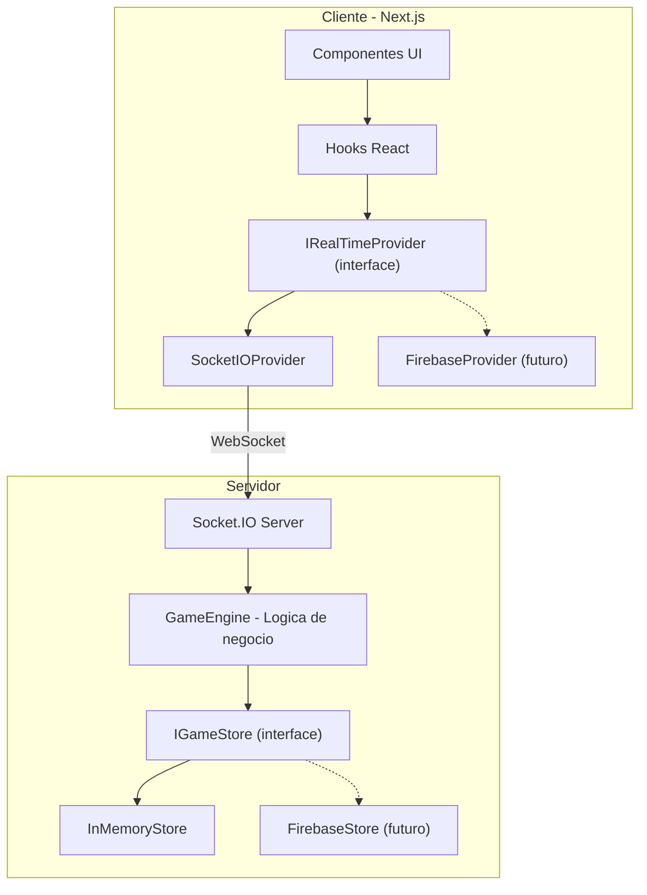
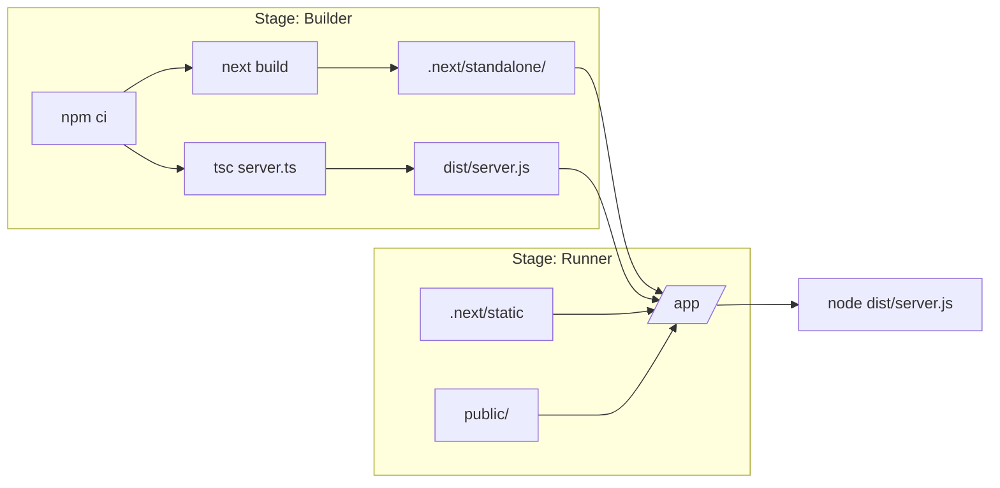

# Prompts de Execucao - Sistema de Quiz em Tempo Real

Baseado em [planejamento_implementacao_quiz_tempo_real.md](planejamento_implementacao_quiz_tempo_real.md) e [especificacao_tecnica_quiz_tempo_real.md](especificacao_tecnica_quiz_tempo_real.md).

**Decisao arquitetural:** Implementar primeiro com WebSocket (Socket.IO), mantendo uma camada de abstracao (Provider Pattern) que permita trocar o transporte para Firebase Realtime Database sem alterar componentes de UI ou logica de negocio.




---

## Fase 1 -- Fundacao (Prompts 1 a 3)

### Prompt 1 -- Setup do Projeto Next.js + Tailwind + Shadcn

**Escopo:** Criar o projeto base com todas as dependencias de UI configuradas.

**Instrucoes de execucao:**

- Inicializar projeto Next.js (App Router) com TypeScript
- Configurar TailwindCSS
- Instalar e configurar Shadcn UI (componentes: Button, Input, Card, Dialog, Badge, Separator, Toast)
- Criar estrutura de pastas:

```
src/
  app/              # Rotas Next.js (App Router)
  components/       # Componentes reutilizaveis
  hooks/            # Custom hooks
  lib/              # Utilitarios e helpers
  types/            # Tipos TypeScript compartilhados
  providers/        # Implementacoes dos providers de real-time
  server/           # Logica do servidor (GameEngine, Store)
```

- Configurar path aliases (`@/`)
- Criar layout base (`app/layout.tsx`) com fonte e metadata
- Criar pagina inicial (`app/page.tsx`) com navegacao para "Criar Sala" e "Entrar em Sala"

**Criterios de aceite:**

- `npm run dev` funciona sem erros
- Pagina inicial renderiza com componentes Shadcn
- Estrutura de pastas completa criada

---

### Prompt 2 -- Tipos TypeScript + Camada de Abstracao (Provider Pattern)

**Escopo:** Definir todos os tipos do dominio e as interfaces de abstracao que permitirao trocar WebSocket por Firebase no futuro.

**Instrucoes de execucao:**

- Criar `types/quiz.ts` com todos os tipos do dominio:

```typescript
export type RoomStatus = 'waiting' | 'playing' | 'result' | 'finished';

export interface Room {
  id: string;
  code: string;
  status: RoomStatus;
  hostId: string;
  currentQuestionIndex: number;
  questionStartTimestamp: number | null;
  participants: Record<string, Participant>;
  questions: Question[];
  answers: Record<string, Record<string, Answer>>;
}

export interface Participant {
  id: string;
  name: string;
  totalScore: number;
  totalResponseTime: number;
  questionsAnswered: number;
  joinedAt: number;
  connected: boolean;
}

export interface Question {
  text: string;
  options: [string, string, string, string];
  correctOptionIndex: number;
}

export interface Answer {
  participantId: string;
  optionIndex: number;
  timestamp: number;
  responseTime: number;
  score: number;
}
```

- Criar `types/events.ts` com os eventos de comunicacao cliente-servidor:

```typescript
export interface ClientEvents {
  'room:create': (data: { questions: Question[] }) => void;
  'room:join': (data: { code: string; name: string }) => void;
  'game:start': () => void;
  'game:next-question': () => void;
  'game:end': () => void;
  'answer:submit': (data: { optionIndex: number }) => void;
}

export interface ServerEvents {
  'room:created': (data: { roomId: string; code: string }) => void;
  'room:joined': (data: { participantId: string }) => void;
  'room:state': (data: Room) => void;
  'room:participant-joined': (data: Participant) => void;
  'game:status-changed': (data: { status: RoomStatus; questionIndex: number; timestamp: number | null }) => void;
  'game:answer-count': (data: { count: number; total: number }) => void;
  'answer:result': (data: { correct: boolean; score: number; correctIndex: number }) => void;
  'ranking:update': (data: Participant[]) => void;
  'error': (data: { message: string; code: string }) => void;
}
```

- Criar `providers/IRealTimeProvider.ts` -- interface abstrata do lado do cliente:

```typescript
export interface IRealTimeProvider {
  connect(roomId: string, role: 'host' | 'participant'): void;
  disconnect(): void;
  
  createRoom(questions: Question[]): Promise<{ roomId: string; code: string }>;
  joinRoom(code: string, name: string): Promise<{ participantId: string }>;
  
  startGame(): void;
  nextQuestion(): void;
  endGame(): void;
  submitAnswer(optionIndex: number): void;
  
  onRoomState(callback: (room: Room) => void): () => void;
  onParticipantJoined(callback: (participant: Participant) => void): () => void;
  onGameStatusChanged(callback: (data: GameStatusData) => void): () => void;
  onAnswerCount(callback: (data: AnswerCountData) => void): () => void;
  onAnswerResult(callback: (data: AnswerResultData) => void): () => void;
  onRankingUpdate(callback: (participants: Participant[]) => void): () => void;
  onError(callback: (error: ErrorData) => void): () => void;
}
```

- Criar `server/IGameStore.ts` -- interface abstrata do lado do servidor:

```typescript
export interface IGameStore {
  createRoom(room: Room): Promise<void>;
  getRoom(roomId: string): Promise<Room | null>;
  getRoomByCode(code: string): Promise<Room | null>;
  updateRoom(roomId: string, updates: Partial<Room>): Promise<void>;
  addParticipant(roomId: string, participant: Participant): Promise<void>;
  addAnswer(roomId: string, questionIndex: number, answer: Answer): Promise<void>;
  updateParticipantScore(roomId: string, participantId: string, scoreIncrement: number, responseTime: number): Promise<void>;
  deleteRoom(roomId: string): Promise<void>;
}
```

**Criterios de aceite:**

- Todos os tipos compilam sem erros
- Interfaces `IRealTimeProvider` e `IGameStore` cobrem todos os fluxos do jogo
- Nenhuma referencia direta a Socket.IO ou Firebase nos tipos/interfaces

---

### Prompt 3 -- Servidor Socket.IO + InMemoryStore + GameEngine

**Escopo:** Implementar o servidor WebSocket com Socket.IO, o armazenamento em memoria e o motor de regras de negocio.

**Instrucoes de execucao:**

- Instalar `socket.io` e `socket.io-client`
- Criar custom server Next.js (`server.ts`) que integra Socket.IO ao servidor HTTP do Next
- Criar `server/InMemoryStore.ts` implementando `IGameStore`:
  - Armazena salas em um `Map<string, Room>`
  - Todas as operacoes sao sincronas internamente (wrappadas em Promise)
- Criar `server/GameEngine.ts` com toda a logica de negocio:
  - `createRoom(questions)` -- gera codigo unico de 6 caracteres, cria sala com status `waiting`
  - `joinRoom(roomId, name)` -- valida nome unico, valida status `waiting`, registra participante
  - `startGame(roomId, hostId)` -- valida que e o host, muda status para `playing`, define `questionStartTimestamp` com `Date.now()`
  - `submitAnswer(roomId, participantId, questionIndex, optionIndex)` -- valida duplicata, valida tempo (120s), calcula pontuacao, atualiza score total
  - `nextQuestion(roomId, hostId)` -- valida que e o host, incrementa index, define novo timestamp, muda status
  - `endGame(roomId, hostId)` -- muda status para `finished`
  - `getRanking(roomId)` -- retorna participantes ordenados pelos criterios de desempate
- Criar `server/SocketHandler.ts` que conecta os eventos Socket.IO ao GameEngine:
  - Mapeia cada evento de `ClientEvents` para a chamada correspondente no GameEngine
  - Emite eventos de `ServerEvents` para os clientes corretos (sala, individual)
  - Usa salas do Socket.IO (`socket.join(roomId)`) para broadcast

**Formula de pontuacao (apenas respostas corretas):**

```typescript
const responseTime = Date.now() - questionStartTimestamp;
const tempoRestante = Math.max(0, 120000 - responseTime);
const score = Math.round(120 * (tempoRestante / 120000));
```

**Criterios de aceite:**

- Servidor Socket.IO sobe junto com `npm run dev`
- GameEngine implementa todas as regras de negocio da especificacao
- InMemoryStore armazena e recupera dados corretamente
- Eventos sao emitidos para os clientes corretos via salas Socket.IO

---

## Fase 2 -- Fluxo Base (Prompts 4 a 6)

### Prompt 4 -- Criacao de Sala (Fluxo do Host)

**Escopo:** Implementar as telas de criacao de sala e lobby do Host.

**Instrucoes de execucao:**

- Criar `providers/SocketIOProvider.ts` implementando `IRealTimeProvider` (funcionalidade parcial: `createRoom`, `connect`, `onRoomState`, `onParticipantJoined`)
- Criar `providers/RealTimeContext.tsx` -- React Context que fornece a instancia do provider
- Criar pagina `app/host/create/page.tsx` com formulario:
  - Adicionar perguntas (enunciado + 4 alternativas + selecionar correta)
  - Validar que cada pergunta tem exatamente 4 alternativas e 1 correta
  - Reordenar perguntas (botoes mover cima/baixo)
  - Minimo de 1 pergunta para criar sala
  - Botao "Criar Sala" envia via provider
- Gerar e armazenar `hostId` (UUID) no localStorage
- Apos criacao, redirecionar para `app/host/[roomId]/page.tsx` (lobby)
- No lobby:
  - Exibir codigo da sala em destaque (copiavel)
  - Lista de participantes atualizada em tempo real via `onParticipantJoined`
  - Botao "Iniciar Jogo" (sem funcionalidade neste prompt)

**Criterios de aceite:**

- Host cria sala com perguntas validas
- Codigo da sala exibido e copiavel
- Lobby mostra participantes em tempo real
- Dados persistem no InMemoryStore do servidor

---

### Prompt 5 -- Entrada de Participante na Sala

**Escopo:** Implementar o fluxo completo de entrada do participante.

**Instrucoes de execucao:**

- Estender `SocketIOProvider` com: `joinRoom`, `onError`
- Criar pagina `app/join/page.tsx` com formulario:
  - Campo: codigo da sala (6 caracteres)
  - Campo: nome do participante
  - Validacao client-side: campos obrigatorios
  - Ao enviar, chama `provider.joinRoom(code, name)`
  - Tratar erros do servidor: sala nao encontrada, nome duplicado, sala ja iniciada
- Gerar `participantId` (UUID) e salvar no localStorage
- Redirecionar para `app/play/[roomId]/page.tsx` (tela de espera)
- Tela de espera:
  - Mensagem "Aguardando o Host iniciar o jogo..."
  - Lista de participantes atualizada em tempo real
  - Nome do participante atual destacado na lista

**Criterios de aceite:**

- Participante entra na sala com nome unico
- Erros de validacao exibidos corretamente (nome duplicado, sala inexistente, sala ja iniciada)
- Tela de espera sincronizada em tempo real
- Host ve o participante aparecer no lobby instantaneamente

---

### Prompt 6 -- Hooks de Sincronizacao via Provider

**Escopo:** Criar hooks reutilizaveis que abstraem a comunicacao com o provider.

**Instrucoes de execucao:**

- Criar `hooks/useRealTime.ts` -- retorna a instancia do provider do contexto
- Criar `hooks/useRoom.ts` -- escuta `onRoomState`, retorna `{ room, loading, error }`
- Criar `hooks/useParticipants.ts` -- derivado do room state, retorna lista de participantes
- Criar `hooks/useGameState.ts` -- derivado do room state, retorna `{ status, currentQuestionIndex, questionStartTimestamp }`
- Criar `hooks/useTimer.ts` -- recebe `questionStartTimestamp`, retorna `{ timeLeft, isExpired, progress }`, atualiza a cada 100ms via `requestAnimationFrame`
- Criar `hooks/useAnswerCount.ts` -- escuta `onAnswerCount`, retorna `{ count, total }`
- Todos os hooks:
  - Fazem cleanup dos listeners no unmount
  - Retornam estado de loading e error
  - Sao agnosticos ao provider (funcionam com Socket.IO ou Firebase)

**Criterios de aceite:**

- Hooks compilam e funcionam com `SocketIOProvider`
- Nenhum hook referencia Socket.IO diretamente
- Cleanup executado corretamente (sem memory leaks)
- `useTimer` calcula countdown com base no timestamp do servidor

---

## Fase 3 -- Execucao do Jogo (Prompts 7 a 11)

### Prompt 7 -- Maquina de Estados + Inicio do Jogo

**Escopo:** Implementar as transicoes de estado da sala e conectar ao fluxo de UI.

**Instrucoes de execucao:**

- Estender `SocketIOProvider` com: `startGame`, `nextQuestion`, `endGame`, `onGameStatusChanged`
- Transicoes no GameEngine (ja implementado no Prompt 3, agora conectar ao frontend):
  - `waiting` -> `playing`: Host clica "Iniciar Jogo"
  - `playing` -> `result`: servidor detecta timeout (120s) ou todos responderam
  - `result` -> `playing`: Host clica "Proxima Pergunta"
  - `result` -> `finished`: ultima pergunta concluida ou Host clica "Encerrar"
- No lobby do Host:
  - Botao "Iniciar Jogo" agora funcional -- chama `provider.startGame()`
  - Desabilitado se < 1 participante
- No `app/play/[roomId]/page.tsx`:
  - Reagir ao `status` via `useGameState`:
    - `waiting` -> tela de espera
    - `playing` -> tela de pergunta (proximo prompt)
    - `result` -> tela de resultado (prompt 11)
    - `finished` -> tela de ranking final (prompt 11)
- No `app/host/[roomId]/page.tsx`:
  - Mesma logica de reacao ao estado, com controles do Host

**Criterios de aceite:**

- Host inicia o jogo e todos os participantes veem a transicao instantaneamente
- Timestamp do servidor registrado ao iniciar cada pergunta
- Entrada bloqueada quando status != `waiting`
- UI reage automaticamente a cada mudanca de estado

---

### Prompt 8 -- Tela de Pergunta + Timer Visual

**Escopo:** Implementar a exibicao da pergunta e o timer sincronizado.

**Instrucoes de execucao:**

- Criar componente `components/QuestionCard.tsx`:
  - Exibe enunciado da pergunta
  - Exibe 4 alternativas como botoes com cores distintas (vermelho, azul, amarelo, verde -- estilo Kahoot)
  - Props: `question`, `onAnswer`, `disabled`, `selectedIndex`
- Criar componente `components/Timer.tsx`:
  - Barra de progresso + numero de segundos restantes
  - Usa `useTimer` hook (baseado no `questionStartTimestamp` do servidor)
  - Muda de cor: verde (> 30s) -> amarelo (30s-10s) -> vermelho (< 10s)
  - Pisca nos ultimos 5 segundos
- No `app/play/[roomId]/page.tsx` quando status == `playing`:
  - Renderizar `QuestionCard` + `Timer`
  - Ao expirar timer, desabilitar alternativas e exibir "Tempo esgotado!"
- No `app/host/[roomId]/page.tsx` quando status == `playing`:
  - Exibir pergunta (somente enunciado, sem resposta correta visivel)
  - Exibir timer
  - Exibir contador "X de Y responderam" via `useAnswerCount`
  - Botao "Encerrar Pergunta" (forca transicao para `result`)

**Criterios de aceite:**

- Pergunta e alternativas renderizam corretamente
- Timer sincronizado via timestamp do servidor (nao relogio local)
- Cores mudam conforme urgencia
- Host ve contagem de respostas em tempo real

---

### Prompt 9 -- Envio de Resposta + Validacao Server-side

**Escopo:** Implementar envio, validacao e bloqueio de respostas.

**Instrucoes de execucao:**

- Estender `SocketIOProvider` com: `submitAnswer`, `onAnswerResult`
- No `QuestionCard`, ao clicar uma alternativa:
  - Chamar `provider.submitAnswer(optionIndex)`
  - Desabilitar todas as alternativas imediatamente (otimista)
  - Destacar a alternativa selecionada
  - Exibir estado "Aguardando resultado..."
- No GameEngine (server-side), ao receber `answer:submit`:
  1. Verificar se participante ja respondeu esta pergunta -> rejeitar com erro
  2. Calcular responseTime = `Date.now()` - `questionStartTimestamp`
  3. Se responseTime > 120000ms -> rejeitar com erro "Tempo esgotado"
  4. Verificar se resposta esta correta
  5. Calcular score (formula do Prompt 3)
  6. Salvar resposta no store
  7. Atualizar pontuacao total do participante
  8. Emitir `answer:result` para o participante (correto/incorreto, score, indice correto)
  9. Emitir `game:answer-count` para a sala inteira
  10. Se todos responderam, emitir transicao para `result`

**Criterios de aceite:**

- Resposta registrada corretamente no servidor
- Duplicata bloqueada no servidor (nao apenas no cliente)
- Resposta fora do tempo rejeitada pelo servidor
- Pontuacao calculada corretamente: `score = Math.round(120 * (tempoRestante / 120000))`
- Participante recebe feedback individual (acertou/errou)
- Host ve contador atualizar em tempo real

---

### Prompt 10 -- Pontuacao + Ranking Dinamico

**Escopo:** Implementar logica de ranking e componente visual.

**Instrucoes de execucao:**

- No GameEngine, implementar `getRanking(roomId)`:
  - Ordenar participantes por: (1) maior `totalScore`, (2) menor tempo medio (`totalResponseTime / questionsAnswered`), (3) menor `joinedAt`
  - Retornar lista ordenada com posicao
- Emitir `ranking:update` para a sala apos cada resposta processada
- Estender `SocketIOProvider` com: `onRankingUpdate`
- Criar `hooks/useRanking.ts` -- escuta `onRankingUpdate`, retorna lista ordenada
- Criar componente `components/Ranking.tsx`:
  - Recebe lista ordenada de participantes
  - Exibe posicao, nome, pontuacao total
  - Destaque visual para top 3 (ouro, prata, bronze com icones/cores)
  - Destaque para o participante atual (se for a tela do participante)
- Criar componente `components/FinalRanking.tsx`:
  - Versao expandida para tela final
  - Podio visual para top 3
  - Destaque claro para o vencedor

**Criterios de aceite:**

- Ranking ordena corretamente pelos 3 criterios de desempate
- Atualiza em tempo real apos cada resposta
- Top 3 com destaque visual diferenciado
- Componente reutilizavel entre tela de resultado e tela final

---

### Prompt 11 -- Tela de Resultado da Rodada + Tela Final

**Escopo:** Implementar as telas de resultado parcial e ranking final.

**Instrucoes de execucao:**

- Quando status == `result` (tela do **Participante**):
  - Exibir se acertou ou errou (icone + cor)
  - Destacar a alternativa correta em verde
  - Se errou, destacar a alternativa escolhida em vermelho
  - Exibir pontuacao obtida na rodada
  - Exibir componente `Ranking` com posicao atualizada
  - Mensagem "Aguardando proxima pergunta..."
- Quando status == `result` (tela do **Host**):
  - Exibir resposta correta destacada
  - Exibir distribuicao de respostas (grafico de barras simples: quantos escolheram cada alternativa)
  - Exibir componente `Ranking`
  - Botao "Proxima Pergunta": chama `provider.nextQuestion()`
  - Se for a ultima pergunta: botao muda para "Ver Ranking Final" -> chama `provider.endGame()`
- Quando status == `finished`:
  - **Participante e Host:** Exibir `FinalRanking` com podio e vencedor
  - Botao "Voltar ao Inicio" para ambos

**Criterios de aceite:**

- Resultado da rodada exibido corretamente para participantes e host
- Distribuicao de respostas visivel para o Host
- Host avanca o jogo e todos veem a transicao
- Ranking final com destaque claro do vencedor

---

## Fase 4 -- Estabilidade e Polimento (Prompts 12 a 14)

### Prompt 12 -- Tratamento de Desconexao

**Escopo:** Garantir resiliencia a desconexoes temporarias.

**Instrucoes de execucao:**

- No servidor Socket.IO:
  - Ao detectar `disconnect`, marcar participante como `connected: false` (nao remover)
  - Emitir `room:participant-disconnected` para a sala
  - Ao reconectar (mesmo `participantId` via localStorage), restaurar:
    - Marcar `connected: true`
    - Enviar estado atual completo da sala via `room:state`
  - Se o Host desconectar: manter sala ativa, exibir aviso para participantes
- No cliente:
  - Detectar desconexao via eventos do Socket.IO (`connect_error`, `disconnect`)
  - Exibir overlay "Reconectando..." com spinner
  - Tentar reconexao automatica (Socket.IO ja faz, mas adicionar feedback visual)
  - Ao reconectar, reenviar identificacao (roomId + participantId/hostId do localStorage)
- Pontuacao acumulada nunca deve ser perdida (armazenada no servidor)

**Criterios de aceite:**

- Participante reconecta e ve o estado atual do jogo
- Pontuacao preservada apos desconexao
- Indicador visual de "Reconectando..." durante desconexao
- Outros participantes veem indicador de quem esta desconectado

---

### Prompt 13 -- Feedback Visual e Animacoes

**Escopo:** Melhorar a experiencia visual com animacoes e transicoes.

**Instrucoes de execucao:**

- Instalar `framer-motion`
- Adicionar animacoes:
  - Transicao entre telas/estados (fade + slide)
  - Entrada das alternativas (staggered, uma por uma)
  - Feedback ao selecionar alternativa (pulse + cor)
  - Timer com urgencia visual (ja parcialmente feito no Prompt 8, refinar)
  - Confetti ao exibir vencedor final (`canvas-confetti`)
  - Animacao de mudanca de posicao no ranking (layout animation do framer-motion)
- Sons opcionais (com toggle para ativar/desativar):
  - Som ao selecionar resposta
  - Tick nos ultimos 5 segundos
  - Som de vitoria/derrota

**Criterios de aceite:**

- Transicoes suaves entre todos os estados
- Confetti na tela final
- Ranking anima mudancas de posicao
- Performance nao degradada (60fps)

---

### Prompt 14 -- Tratamento de Erros e Edge Cases

**Escopo:** Cobrir todos os cenarios de erro e borda.

**Instrucoes de execucao:**

- Tratamento de erros:
  - Sala nao encontrada (codigo invalido) -> mensagem clara no formulario
  - Sala ja iniciada -> "Esta sala ja esta em andamento"
  - Servidor offline/indisponivel -> tela de erro com retry
  - Host desconecta durante o jogo -> aviso para participantes
  - Participante acessa URL direta sem estar registrado -> redirecionar para `/join`
  - Navegador fecha e reabre -> tentar restaurar sessao via localStorage
- Criar componente `components/ErrorBoundary.tsx`
- Criar pagina `app/not-found.tsx` customizada
- Adicionar toasts (Shadcn Toast) para feedback de acoes e erros inline
- Validacao de todos os formularios com mensagens claras
- Timeout no servidor: auto-transicao para `result` quando timer expira (nao depender do cliente)

**Criterios de aceite:**

- Nenhum erro nao tratado visivel ao usuario
- Mensagens de erro claras e amigaveis em portugues
- Servidor faz timeout automatico (nao depende do cliente)
- Sessao restauravel via localStorage

---

## Fase 5 -- Biblioteca de Quizzes (Prompt 15)

### Prompt 15 -- Biblioteca de Quizzes (localStorage)

**Escopo:** Permitir que o Host salve, liste, edite e reutilize conjuntos de perguntas, evitando recriar tudo a cada sessao.

**Instrucoes de execucao:**

- Criar tipo `SavedQuiz` em `types/quiz.ts`:

```typescript
export interface SavedQuiz {
  id: string;
  title: string;
  questions: Question[];
  createdAt: number;
  updatedAt: number;
}
```

- Criar `lib/quizStorage.ts` com funcoes utilitarias para CRUD no localStorage:
  - `getQuizzes(): SavedQuiz[]` -- retorna todos os quizzes salvos, ordenados por `updatedAt` desc
  - `getQuiz(id: string): SavedQuiz | null`
  - `saveQuiz(quiz: Omit<SavedQuiz, 'id' | 'createdAt' | 'updatedAt'>): SavedQuiz` -- cria novo
  - `updateQuiz(id: string, updates: Partial<Pick<SavedQuiz, 'title' | 'questions'>>): SavedQuiz`
  - `deleteQuiz(id: string): void`
  - `duplicateQuiz(id: string): SavedQuiz` -- cria copia com titulo "Copia de ..."
  - Chave localStorage: `quiz_library`
- Criar pagina `app/host/page.tsx` -- Dashboard do Host / Biblioteca de Quizzes:
  - Lista de quizzes salvos em cards (titulo, quantidade de perguntas, data de atualizacao)
  - Cada card com acoes: "Iniciar Sala", "Editar", "Duplicar", "Excluir"
  - Botao "Criar Novo Quiz" -> redireciona para `app/host/create/page.tsx`
  - Se nao houver quizzes salvos, exibir estado vazio com CTA para criar
  - Confirmacao (Dialog) ao excluir
- Atualizar `app/host/create/page.tsx`:
  - Ao criar sala, oferecer opcao "Salvar quiz na biblioteca" (checkbox ou botao separado)
  - Se veio de edicao de quiz existente (query param `?quizId=xxx`), pre-carregar perguntas
  - Apos salvar/criar: redirecionar para lobby normalmente
- Criar pagina `app/host/edit/[quizId]/page.tsx` -- Edicao de quiz salvo:
  - Mesmo formulario do create, mas pre-carregado com dados do quiz
  - Botao "Salvar Alteracoes" (atualiza no localStorage)
  - Botao "Iniciar Sala com este Quiz" (cria sala + redireciona ao lobby)
- Fluxo "Iniciar Sala" a partir da biblioteca:
  - Ao clicar "Iniciar Sala" no card, carregar as perguntas do quiz salvo
  - Chamar `provider.createRoom(questions)` diretamente
  - Redirecionar para o lobby (`app/host/[roomId]/page.tsx`)
- Atualizar pagina inicial (`app/page.tsx`):
  - Link "Criar Sala" agora aponta para `app/host` (dashboard) em vez de `app/host/create`

**Criterios de aceite:**

- Host consegue salvar um quiz e ve-lo na lista
- Host consegue iniciar uma sala a partir de um quiz salvo (sem recriar perguntas)
- Edicao de quiz salvo funciona corretamente
- Duplicar quiz cria copia independente
- Excluir quiz pede confirmacao e remove
- Dados persistem entre recarregamentos da pagina (localStorage)
- Formulario de criacao pode opcionalmente salvar o quiz na biblioteca

---

## Fase 6 -- Acessibilidade, Layout e Polimento (Prompts 16 a 19)

### Prompt 16 -- Atalhos de Teclado para Respostas (A S D F)

**Escopo:** Permitir que participantes respondam usando teclas do teclado, melhorando a velocidade e acessibilidade.

**Instrucoes de execucao:**

- No componente `QuestionCard.tsx`:
  - Mapear teclas: `A` -> opcao 0, `S` -> opcao 1, `D` -> opcao 2, `F` -> opcao 3
  - Aceitar tanto maiusculas quanto minusculas
  - Exibir a tecla correspondente em cada botao de alternativa (badge ou texto pequeno: "A", "S", "D", "F")
  - Somente ativar quando o componente nao esta `disabled`
  - Ignorar se `selectedIndex !== null` (ja respondeu)
  - Usar `useEffect` com `keydown` listener, com cleanup adequado
- Adicionar indicador visual no botao ao pressionar a tecla (breve highlight antes de confirmar)
- Garantir que nao conflita com inputs de texto abertos (nao ativar se o foco esta em input/textarea)

**Criterios de aceite:**

- Participante pressiona A, S, D ou F e a resposta e enviada
- Tecla so funciona quando as alternativas estao habilitadas
- Badge com a letra visivel em cada alternativa
- Nao interfere com campos de texto em outras telas

---

### Prompt 17 -- Layout Responsivo e Espacamento

**Escopo:** Aumentar largura maxima e espacamento para melhor respiro visual.

**Instrucoes de execucao:**

- Telas do Host (`app/host/[roomId]/page.tsx`, `app/host/page.tsx`, `app/host/create/page.tsx`, `app/host/edit/[quizId]/page.tsx`):
  - Aumentar `max-w-lg` para `max-w-4xl` (ou `max-w-[1440px]` onde necessario)
  - Aumentar padding geral (`p-8` -> `p-8 lg:p-12`)
  - Cards com mais padding interno
  - Timer e contador de respostas com tipografia maior para projecao em tela grande
  - Ranking com itens mais espacados
- Telas do Participante (`app/play/[roomId]/page.tsx`):
  - Aumentar `max-w-lg` para `max-w-2xl`
  - Alternativas com `min-h-[80px]` (em vez de 60px) para toque facil em mobile
  - Tipografia do enunciado um pouco maior (`text-xl`)
  - Timer mais visivel
- Tela inicial (`app/page.tsx`):
  - Manter centrada, mas com cards maiores
- Garantir que tudo se adapta a mobile (responsivo, nao apenas desktop)

**Criterios de aceite:**

- Telas do Host confortaveis em monitor/projetor (1440px+)
- Telas do participante legiveis em smartphones
- Nenhum layout quebrado em nenhuma resolucao
- Espacamento e tipografia consistentes

---

### Prompt 18 -- Confetti no Resultado de Cada Pergunta

**Escopo:** Adicionar confetti ao final de cada pergunta para celebrar acertos.

**Instrucoes de execucao:**

- Usar `canvas-confetti` (ja instalado no projeto)
- Extrair logica de confetti para `lib/confetti.ts`:
  - `fireConfetti()` -- confetti completo (para acertos e ranking final)
  - `fireConfettiLight()` -- confetti mais sutil/curto (para o host no fim de cada rodada)
  - Reutilizar a funcao `fireConfetti` ja existente em `FinalRanking.tsx`
- Tela do Participante (`ResultCard.tsx` ou `app/play/[roomId]/page.tsx`):
  - Quando status muda para `result` e o participante **acertou**: disparar `fireConfetti()`
  - Se errou ou nao respondeu: nao disparar confetti
- Tela do Host (`app/host/[roomId]/page.tsx`):
  - Quando status muda para `result`: disparar `fireConfettiLight()` (indicando fim da rodada)
- Garantir que nao dispara multiplas vezes na mesma transicao

**Criterios de aceite:**

- Participante que acertou ve confetti na tela de resultado
- Participante que errou nao ve confetti
- Host ve confetti leve ao fim de cada rodada
- Confetti do ranking final continua funcionando como antes
- Nenhum confetti duplicado

---

### Prompt 19 -- Polimento UX das Telas

**Escopo:** Melhorar a experiencia geral com ajustes finos de UX em todas as telas.

**Instrucoes de execucao:**

- Tela inicial (`app/page.tsx`):
  - Adicionar icones nos cards (ex: `Users` para Criar Sala, `LogIn` para Entrar)
  - Animacao sutil de entrada (fade in)
- Tela de Join (`app/join/page.tsx`):
  - Auto-focus no campo de codigo ao abrir
  - Mascara visual no campo de codigo (letras maiusculas, espacamento)
- Lobby do Host (`app/host/[roomId]/page.tsx`):
  - Codigo da sala com tipografia ainda maior e mais destaque
  - Animacao ao novo participante entrar (slide in na lista)
  - Contador de participantes animado
- Tela de pergunta (participante):
  - Numero da pergunta com badge colorido ("Pergunta 3 de 10")
  - Transicao mais dramatica ao entrar nova pergunta
- Tela de resultado:
  - Pontuacao com animacao de contagem (0 -> score)
  - Posicao no ranking com destaque visual ("Voce subiu para 2o lugar!")
- Tela do Host durante jogo:
  - Contador "X de Y responderam" com barra de progresso
  - Tipografia grande legivel em projetor
- Biblioteca de quizzes:
  - Animacao de entrada nos cards
  - Preview das primeiras perguntas no card (truncado)
  - Ordenacao/filtro visual (mais recente, por titulo)
- Consistencia geral:
  - Todos os botoes de acao principal com mesmo estilo
  - Espacamento uniforme entre secoes
  - Loading states consistentes (skeleton ou spinner)

**Criterios de aceite:**

- Todas as telas com experiencia fluida e polida
- Animacoes sutis que nao atrapalham o fluxo
- Consistencia visual em todo o app
- Legibilidade excelente tanto em mobile quanto projetor

---

## Fase 7 -- Migracao para Firebase (Prompts 20 a 21)

### Prompt 20 -- Setup Firebase + Provider Firebase

**Escopo:** Implementar o provider Firebase e o store Firebase, substituindo WebSocket.

**Instrucoes de execucao:**

- Instalar `firebase` SDK
- Criar `lib/firebase.ts` com inicializacao (variaveis de ambiente)
- Criar `.env.local.example` com variaveis necessarias
- Criar `providers/FirebaseProvider.ts` implementando `IRealTimeProvider`:
  - Usar `firebase.database().ref()` com listeners `on('value')` para substituir eventos Socket.IO
  - Manter a mesma interface que `SocketIOProvider`
  - Usar `ServerValue.TIMESTAMP` para timestamps
- Criar `server/FirebaseStore.ts` implementando `IGameStore`:
  - Substituir `InMemoryStore` por Firebase Realtime Database
  - Manter a mesma interface
- Atualizar `RealTimeContext.tsx` para aceitar configuracao de qual provider usar (via variavel de ambiente `NEXT_PUBLIC_PROVIDER=websocket|firebase`)
- Nenhuma alteracao nos componentes de UI, hooks ou GameEngine

**Criterios de aceite:**

- Aplicacao funciona identicamente com `NEXT_PUBLIC_PROVIDER=firebase`
- Nenhum componente de UI foi alterado
- Hooks continuam funcionando sem mudanca
- Dados persistem no Firebase Realtime Database

---

### Prompt 21 -- Cloud Functions + Regras de Seguranca

**Escopo:** Mover validacao critica para Cloud Functions e configurar seguranca.

**Instrucoes de execucao:**

- Inicializar Firebase Functions (`functions/` directory, TypeScript)
- Criar Cloud Function `onAnswerSubmitted`:
  - Trigger: `onValueCreated` em `rooms/{roomId}/answers/{questionIndex}/{participantId}`
  - Validar: sala em status `playing`, participante valido, tempo <= 120s
  - Calcular pontuacao e atualizar `totalScore` via transacao atomica
  - Rejeitar respostas invalidas (deletar do path)
- Criar Cloud Function `cleanupFinishedRooms` (scheduled, a cada 24h):
  - Remover salas com status `finished` ha mais de 24 horas
- Definir Firebase Realtime Database Security Rules (`database.rules.json`):
  - Participante so escreve em `participants/{seu_id}` e `answers/{questionIndex}/{seu_id}`
  - `totalScore` so pode ser escrito por Cloud Functions
  - `status` so alterado pelo `hostId`
  - Respostas nao podem ser sobrescritas
- Testar com Firebase Emulator

**Criterios de aceite:**

- Cloud Functions deployam sem erros
- Pontuacao validada e calculada no servidor (Cloud Functions)
- Regras de seguranca impedem manipulacao indevida
- Salas finalizadas sao limpas automaticamente
- Tudo testado com emulador

---

## Fase 8 -- Teste de Carga e Limites de Usuarios Simultaneos (Prompts 22 a 24)

### Prompt 22 -- Setup de Teste de Carga (Artillery + Socket.IO)

**Escopo:** Configurar infraestrutura de testes de carga usando Artillery com suporte a Socket.IO para simular centenas/milhares de participantes simultaneos.

**Instrucoes de execucao:**

- Instalar dependencias de teste (devDependencies):
  - `artillery` -- ferramenta de teste de carga
  - `artillery-engine-socketio-v3` -- plugin para Socket.IO v4+
- Criar diretorio `load-tests/` na raiz do projeto
- Criar `load-tests/artillery.yml` (config base):
  - Target: `http://localhost:3000`
  - Engine: `socketio-v3`
  - Variaveis: numero de participantes por sala, duracao do teste
  - Phases: warmup (ramp-up gradual) e sustained (carga constante)
- Criar `load-tests/functions.js` com helpers:
  - `generateUniqueName(ctx)` -- gera nome aleatorio para participante
  - `generateRoomCode(ctx)` -- armazena codigo de sala para reuso
  - `randomDelay(ctx)` -- simula tempo humano de resposta (1-10s)
  - `pickRandomOption(ctx)` -- escolhe alternativa aleatoria (0-3)
- Criar `load-tests/scenarios/` com cenarios base:
  - `create-room.yml` -- host cria sala com 5 perguntas
  - `join-and-play.yml` -- participante entra, responde todas as perguntas
  - `full-game.yml` -- fluxo completo: 1 host + N participantes
- Criar `load-tests/seed-quiz.js`:
  - Script que pre-cria uma sala via API/Socket para os testes usarem
  - Exporta roomId e code para os cenarios de participante
- Adicionar scripts no `package.json`:
  - `"test:load:setup"` -- inicia servidor + cria sala seed
  - `"test:load:small"` -- 10 usuarios simultaneos
  - `"test:load:medium"` -- 50 usuarios simultaneos
  - `"test:load:large"` -- 200 usuarios simultaneos
  - `"test:load:stress"` -- 500+ usuarios (encontrar ponto de quebra)

**Criterios de aceite:**

- `yarn test:load:small` executa sem erros com 10 usuarios
- Metricas de latencia (p50, p95, p99) sao reportadas
- Taxa de erro e reportada
- Cenarios reutilizaveis e parametrizaveis
- Documentacao clara sobre como rodar os testes

---

### Prompt 23 -- Cenarios de Teste de Carga (Escalonamento)

**Escopo:** Criar cenarios progressivos que identifiquem o ponto de saturacao do servidor e os gargalos.

**Instrucoes de execucao:**

- Criar cenarios escalonados em `load-tests/scenarios/`:
  - **Cenario A -- Conexao massiva:**
    - N participantes entram na mesma sala simultaneamente
    - Metricas: tempo de join, taxa de sucesso, memoria do servidor
    - Testar: 10, 25, 50, 100, 200, 500 participantes
  - **Cenario B -- Resposta simultanea:**
    - Todos os participantes respondem ao mesmo tempo (burst)
    - Metricas: latencia de submitAnswer, taxa de respostas aceitas, respostas perdidas
    - Simular: todos respondem em janela de 1-2 segundos
  - **Cenario C -- Jogo completo sob carga:**
    - 1 host + N participantes jogando 10 perguntas
    - Host avanca automaticamente entre perguntas
    - Metricas: latencia media por pergunta, drift do timer, consistencia do ranking
  - **Cenario D -- Multiplas salas:**
    - K salas simultaneas, cada uma com M participantes
    - Metricas: isolamento entre salas, uso de memoria, CPU
    - Testar: 5 salas x 20 usuarios, 10 salas x 50 usuarios
  - **Cenario E -- Desconexao/Reconexao sob carga:**
    - X% dos participantes desconectam e reconectam durante o jogo
    - Metricas: taxa de reconexao bem-sucedida, estado consistente apos reconexao
- Criar `load-tests/monitor.js`:
  - Script que coleta metricas do servidor durante o teste:
    - Uso de memoria (RSS, heap)
    - Conexoes Socket.IO ativas
    - Event loop delay (lag)
    - Respostas processadas por segundo
  - Expor endpoint `/api/metrics` no servidor (apenas em dev/test)
- Adicionar ao `server/SocketHandler.ts` ou middleware:
  - Contador de conexoes ativas
  - Contador de mensagens processadas/segundo
  - Hook para exportar metricas

**Criterios de aceite:**

- Cada cenario executa e gera relatorio com metricas
- Ponto de saturacao identificado (quando latencia p99 > 2s ou taxa de erro > 5%)
- Metricas do servidor coletadas durante cada teste
- Testes reproduziveis em maquina local e CI

---

### Prompt 24 -- Dashboard de Resultados + Relatorio de Limites

**Escopo:** Consolidar resultados dos testes em um relatorio claro e criar scripts de analise automatizada.

**Instrucoes de execucao:**

- Criar `load-tests/analyze.js`:
  - Le os relatorios JSON do Artillery (`load-tests/results/`)
  - Gera tabela resumo:
    - | Cenario | Usuarios | p50 (ms) | p95 (ms) | p99 (ms) | Erros (%) | Memoria (MB) |
  - Identifica automaticamente o ponto de quebra:
    - "O servidor suporta ate X usuarios simultaneos com p99 < 500ms"
    - "A partir de Y usuarios, a taxa de erro ultrapassa 5%"
  - Exporta resultados em Markdown para `load-tests/RESULTS.md`
- Criar `load-tests/run-all.sh`:
  - Script que executa todos os cenarios em sequencia
  - Aguarda cooldown entre testes (30s)
  - Coleta metricas do servidor em cada teste
  - Gera relatorio consolidado ao final
- Criar `load-tests/RESULTS.md` (template):
  - Secao: Ambiente de teste (hardware, OS, Node.js version)
  - Secao: Resultados por cenario (tabela)
  - Secao: Gargalos identificados
  - Secao: Recomendacoes de otimizacao
  - Secao: Limites recomendados para producao
- Documentar no `load-tests/README.md`:
  - Como rodar os testes
  - Pre-requisitos
  - Interpretacao dos resultados
  - Como ajustar parametros (numero de usuarios, duracao)

**Criterios de aceite:**

- Script `run-all.sh` executa todos os cenarios e gera relatorio
- Relatorio `RESULTS.md` gerado automaticamente com dados reais
- Ponto de quebra claramente documentado
- Recomendacoes de otimizacao baseadas nos gargalos encontrados
- README com instrucoes claras para reproduzir os testes
- Limites recomendados para producao documentados (ex: "maximo de X usuarios por sala, Y salas simultaneas")

---

## Fase 9 -- Deploy e Infraestrutura (Prompt 25)

### Prompt 25 -- Imagem Docker para Producao (Standalone + Custom Server)

**Escopo:** Criar uma imagem Docker otimizada para producao, usando Next.js standalone output combinado com o custom server (Socket.IO), resultando em uma imagem leve e pronta para deploy.

**Contexto tecnico:**

O projeto usa um custom server (`server.ts`) que integra Socket.IO ao Next.js. O modo `output: 'standalone'` do Next.js gera um bundle minimo com apenas as dependencias necessarias, mas **nao inclui automaticamente o custom server**. A estrategia e:

1. Habilitar `output: 'standalone'` no `next.config`
2. Compilar `server.ts` e `src/server/` para JavaScript com `tsc` (eliminando necessidade de `tsx` em runtime)
3. Copiar o servidor compilado para dentro do bundle standalone
4. Resultado: imagem ~180MB em vez de ~500MB+




**Instrucoes de execucao:**

- Atualizar `next.config.js` (ou converter `next.config.ts` para `.js` para evitar dependencia de TypeScript em runtime):

```javascript
/** @type {import('next').NextConfig} */
const nextConfig = {
  output: 'standalone',
};

module.exports = nextConfig;
```

- Criar `tsconfig.server.json` para compilar apenas o servidor:

```json
{
  "extends": "./tsconfig.json",
  "compilerOptions": {
    "module": "commonjs",
    "outDir": "./dist",
    "noEmit": false,
    "declaration": false
  },
  "include": ["server.ts", "src/server/**/*.ts", "src/types/**/*.ts"]
}
```

- Adicionar script de build do servidor no `package.json`:

```json
{
  "scripts": {
    "build:server": "tsc -p tsconfig.server.json",
    "build:all": "npm run build && npm run build:server"
  }
}
```

- Criar `Dockerfile` com multi-stage build otimizado:

```dockerfile
# Build stage
FROM node:20-alpine AS builder
WORKDIR /app

COPY package.json package-lock.json* ./
RUN npm ci

COPY . .

RUN mkdir -p public
RUN npm run build:all

# Production stage
FROM node:20-alpine AS runner
WORKDIR /app

ENV NODE_ENV=production
ENV PORT=3000

RUN addgroup --system --gid 1001 nodejs
RUN adduser --system --uid 1001 nextjs

# Copiar bundle standalone do Next.js (inclui node_modules minimos)
COPY --from=builder /app/.next/standalone ./
# Copiar assets estaticos (nao incluidos no standalone)
COPY --from=builder /app/.next/static ./.next/static
COPY --from=builder /app/public ./public
# Copiar servidor customizado compilado
COPY --from=builder /app/dist/server.js ./dist/server.js
COPY --from=builder /app/dist/src ./dist/src

USER nextjs
EXPOSE 3000

# Usar node diretamente (sem tsx, sem npx)
CMD ["node", "dist/server.js"]
```

- Criar `.dockerignore` para excluir arquivos desnecessarios do contexto de build:

```
node_modules
.next
.git
load-tests
coverage
*.test.ts
*.spec.ts
.env*.local
.DS_Store
README*
LICENSE
.vscode
.idea
```

- Ajustar `server.ts` para que os imports funcionem apos compilacao:
  - Verificar que os paths `@/*` sao resolvidos corretamente no `tsconfig.server.json`
  - Se necessario, usar paths relativos no `server.ts` e `src/server/` para evitar problemas com alias apos compilacao
  - Alternativa: usar `tsc-alias` ou `tsconfig-paths` para resolver aliases no build
- Adicionar script de conveniencia no `package.json`:

```json
{
  "scripts": {
    "docker:build": "docker build -t hootka:latest .",
    "docker:run": "docker run --rm -p 3000:3000 hootka:latest"
  }
}
```

- Testar o container:
  1. `npm run docker:build` -- build da imagem
  2. `npm run docker:run` -- iniciar container
  3. Acessar `http://localhost:3000` -- verificar pagina inicial
  4. Criar sala e entrar com participante -- verificar WebSocket funcionando
  5. Jogar uma partida completa -- verificar que tudo funciona

**Criterios de aceite:**

- `docker build` completa sem erros
- Container inicia e responde em `http://localhost:3000` em menos de 5 segundos
- WebSocket (Socket.IO) funciona corretamente dentro do container
- Imagem final menor que 250MB (idealmente ~180MB com standalone)
- Container roda como usuario nao-root (`nextjs`)
- Nenhuma dependencia de desenvolvimento presente na imagem final (sem `tsx`, sem `typescript`, sem `artillery`)
- Variavel `PORT` configuravel via environment variable
- `node dist/server.js` como entrypoint (sem overhead de tsx/npx)

---

## Fase 10 -- Monetizacao e Analise (Prompts 26 e 27)

### Prompt 26 -- Google Analytics (GA4)

**Escopo:** Integrar Google Analytics 4 para metricas de uso e comportamento, respeitando privacidade (LGPD/GDPR).

**Instrucoes de execucao:**

- Criar componente `components/GoogleAnalytics.tsx` que carrega o script do GA4 via `next/script` com estrategia `afterInteractive`
- Usar variavel de ambiente `NEXT_PUBLIC_GA_MEASUREMENT_ID` (ex: `G-XXXXXXXXXX`)
- Incluir o componente no `app/layout.tsx` para rastrear todas as paginas
- Configurar eventos customizados opcionais: `room_created`, `room_joined`, `game_started`, `game_finished`
- Criar pagina `app/privacy/page.tsx` com politica de privacidade
- Implementar mecanismo de consentimento (cookie banner ou preferencias) antes de ativar o tracking
- Opcional: usar `react-consent-manager` ou solucao leve (estado localStorage + modal)
- Adicionar ao `.env.example`:

```
  NEXT_PUBLIC_GA_MEASUREMENT_ID=
  NEXT_PUBLIC_GA_ENABLED=false
  

```

- Permitir desabilitar GA via env para desenvolvimento e testes

**Criterios de aceite:**

- Google Analytics rastreia pageviews em todas as rotas
- Nenhum script carrega sem consentimento do usuario (ou em modo dev com flag desabilitada)
- Pagina de politica de privacidade acessivel
- Variaveis de ambiente documentadas

---

### Prompt 27 -- Google AdSense

**Escopo:** Integrar Google AdSense para monetizacao via anuncios, utilizando o mecanismo de consentimento do Prompt 26.

**Instrucoes de execucao:**

- Criar componente `components/AdSense.tsx` que renderiza blocos de anuncio
- Usar variavel de ambiente `NEXT_PUBLIC_ADSENSE_CLIENT_ID` (ex: `ca-pub-XXXXXXXXXXXXXXXX`)
- Carregar script do AdSense via `next/script` com estrategia `lazyOnload`
- Respeitar o consentimento do usuario (usar mesmo mecanismo do GA) antes de exibir anuncios
- Definir slots de anuncio em posicoes estrategicas:
  - Banner horizontal na pagina inicial (abaixo dos botoes Criar/Entrar)
  - Banner ou retangulo lateral nas telas do Host (lobby, durante jogo)
  - Banner na tela de espera do participante
- Garantir que anuncios nao aparecem durante perguntas ativas (evitar distracao)
- Respeitar limite de anuncios por pagina (max 3-4 blocos visiveis)
- Adicionar `ads.txt` em `public/ads.txt` para verificacao do dominio
- Adicionar ao `.env.example`:

```
  NEXT_PUBLIC_ADSENSE_CLIENT_ID=
  NEXT_PUBLIC_ADSENSE_ENABLED=false
  

```

- Permitir desabilitar AdSense via env para desenvolvimento e testes

**Criterios de aceite:**

- AdSense exibe anuncios nas posicoes definidas (quando habilitado e aprovado)
- Anuncios so carregam apos consentimento do usuario
- Experiencia do quiz nao degradada (anuncios fora do fluxo principal do jogo)
- Arquivo `ads.txt` configurado para o dominio

---

## Fase 11 -- Importacao e Exportacao de Quizzes (Prompt 28)

### Prompt 28 -- Exportar e Importar Quizzes na Biblioteca

**Escopo:** Permitir que o Host exporte quizzes salvos como arquivo JSON e importe quizzes a partir de arquivos, facilitando compartilhamento e backup.

**Instrucoes de execucao:**

- Definir formato de exportacao em `types/quiz.ts`:

```typescript
export interface ExportedQuiz {
  version: 1;
  title: string;
  questions: Question[];
  exportedAt: number;
}
```

- Criar `lib/quizExportImport.ts` com funcoes utilitarias:
  - `exportQuiz(quiz: SavedQuiz): ExportedQuiz` -- converte quiz salvo para formato de exportacao (sem `id`, `createdAt`, `updatedAt` internos)
  - `exportQuizToFile(quiz: SavedQuiz): void` -- gera arquivo JSON e dispara download no navegador (`quiz-<titulo-slug>.json`)
  - `exportMultipleQuizzes(quizzes: SavedQuiz[]): void` -- exporta multiplos quizzes em um unico arquivo JSON (array de `ExportedQuiz`)
  - `parseImportFile(file: File): Promise<ExportedQuiz | ExportedQuiz[]>` -- le arquivo JSON, valida estrutura e retorna quiz(zes) parseados
  - `validateExportedQuiz(data: unknown): ExportedQuiz` -- valida que o JSON tem a estrutura correta (`version`, `title`, `questions` com 4 opcoes e `correctOptionIndex` valido), lanca erro descritivo se invalido
  - `importQuiz(exported: ExportedQuiz): SavedQuiz` -- converte formato de exportacao para `SavedQuiz` e salva no localStorage via `quizStorage.saveQuiz()`
  - `importMultipleQuizzes(exported: ExportedQuiz[]): SavedQuiz[]` -- importa multiplos quizzes de uma vez
- Atualizar pagina `app/host/page.tsx` (Biblioteca de Quizzes):
  - Adicionar botao "Importar Quiz" no topo da pagina (ao lado de "Criar Novo Quiz"):
    - Ao clicar, abre seletor de arquivo (`<input type="file" accept=".json">` oculto)
    - Aceita arquivos `.json`
    - Apos selecionar arquivo, valida e importa
    - Exibe toast de sucesso com nome do quiz importado ou toast de erro se formato invalido
    - Se o arquivo contem multiplos quizzes, importa todos e exibe toast com quantidade
  - Em cada card de quiz na lista, adicionar acao "Exportar" (icone de download):
    - Ao clicar, chama `exportQuizToFile(quiz)` e dispara download do arquivo JSON
  - Adicionar opcao de selecao multipla (checkbox em cada card) com botao "Exportar Selecionados":
    - Aparece quando pelo menos 1 quiz esta selecionado
    - Exporta todos os selecionados em um unico arquivo JSON
- Criar componente `components/ImportQuizDialog.tsx`:
  - Dialog/modal que aparece ao importar com preview do quiz:
    - Titulo do quiz
    - Quantidade de perguntas
    - Preview das primeiras 3 perguntas (truncado)
  - Botao "Importar" para confirmar
  - Botao "Cancelar" para desistir
  - Se multiplos quizzes, exibir lista com checkbox para selecionar quais importar
- Tratamento de erros na importacao:
  - Arquivo nao e JSON valido -> "Arquivo invalido. Selecione um arquivo .json exportado pelo Karoot."
  - JSON nao tem estrutura esperada -> "Formato incompativel. O arquivo nao contem um quiz valido."
  - Pergunta com menos de 4 alternativas -> "Quiz invalido: a pergunta X tem menos de 4 alternativas."
  - `correctOptionIndex` fora do range 0-3 -> "Quiz invalido: indice de resposta correta invalido na pergunta X."
  - Arquivo vazio -> "Arquivo vazio."
- Adicionar suporte a drag-and-drop na pagina da biblioteca:
  - Area de drop visual (borda tracejada) ao arrastar arquivo sobre a pagina
  - Ao soltar arquivo `.json`, inicia fluxo de importacao

**Criterios de aceite:**

- Host exporta quiz individual como arquivo `.json` com um clique
- Host exporta multiplos quizzes selecionados em um unico arquivo
- Host importa quiz(zes) a partir de arquivo `.json` (via botao ou drag-and-drop)
- Dialog de preview exibido antes de confirmar importacao
- Validacao robusta do arquivo importado com mensagens de erro claras
- Quiz importado aparece na biblioteca com titulo original e data de importacao
- Formato de exportacao e versionado (`version: 1`) para compatibilidade futura
- Ciclo completo funciona: exportar quiz -> importar em outro navegador/dispositivo -> quiz identico disponivel

