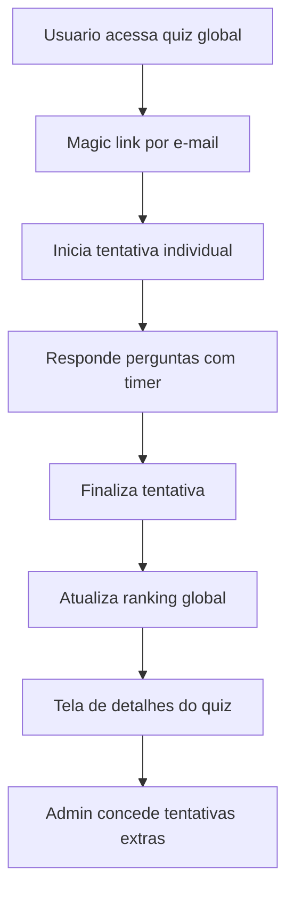

# Spec-Driven: Quiz Global

## Objetivo

Adicionar ao Hootka um novo modo de produto, separado do fluxo de sala ao vivo, para quizzes globais assíncronos com:

- catálogo híbrido de quizzes `official` e `community`
- autenticação por e-mail com magic link como identidade principal
- ranking global por quiz com pontuação baseada em acerto + tempo
- limite de tentativas configurável por quiz, com override por admin
- suporte a perguntas com `2..5` alternativas e `1` resposta correta

## Base existente a reaproveitar

- O domínio atual é centrado em `Room`, `Participant` e `Question` em [src/types/quiz.ts](/Users/jade/Workspace/playground/hootka/src/types/quiz.ts).
- A execução em sala usa engine + store (`GameEngine` + `IGameStore`) em [src/server/GameEngine.ts](/Users/jade/Workspace/playground/hootka/src/server/GameEngine.ts) e [src/server/IGameStore.ts](/Users/jade/Workspace/playground/hootka/src/server/IGameStore.ts).
- A biblioteca pessoal já alterna local/cloud via [src/hooks/useQuizLibrary.ts](/Users/jade/Workspace/playground/hootka/src/hooks/useQuizLibrary.ts) e [src/lib/quizStorageCloud.ts](/Users/jade/Workspace/playground/hootka/src/lib/quizStorageCloud.ts).
- A autenticação já existe, mas hoje só com Google, em [src/providers/AuthProvider.tsx](/Users/jade/Workspace/playground/hootka/src/providers/AuthProvider.tsx).

## Decisões de produto fechadas

- Primeira fase já inclui quizzes `official` e `community`.
- O login principal do quiz global será por e-mail com magic link.
- Cada quiz define seu próprio `attemptLimit` no momento de criação/edição.
- Admin gerencia tentativas extras na tela de detalhes do quiz.
- Perguntas passam a suportar `2..5` alternativas, com apenas `1` correta.

## Delimitação arquitetural

Não acoplar o Quiz Global à abstração atual de `IRealTimeProvider`, porque esse contrato foi desenhado para sessões síncronas de sala. Em vez disso, criar um domínio paralelo de "global quiz" com persistência própria e hooks específicos.

## Modelo de domínio proposto

Criar novos tipos em [src/types/quiz.ts](/Users/jade/Workspace/playground/hootka/src/types/quiz.ts) ou, preferencialmente, extrair para um novo arquivo de domínio global se o arquivo atual crescer demais.

Entidades novas:

- `GlobalQuiz`
  - `id`, `slug`, `title`, `description`, `topic`
  - `questions`
  - `visibility: 'official' | 'community'`
  - `status: 'draft' | 'published' | 'archived'`
  - `attemptLimit`
  - `createdBy`, `createdAt`, `updatedAt`, `publishedAt`
- `GlobalQuizQuestion`
  - `text`
  - `options: string[]` com validação `2..5`
  - `correctOptionIndex`
  - `timeLimitMs` opcional por pergunta ou herança de default do quiz
- `GlobalQuizAttempt`
  - `id`, `quizId`, `userId`
  - `answers`
  - `totalScore`, `totalResponseTime`, `completedAt`
  - `status: 'in_progress' | 'completed' | 'abandoned'`
- `GlobalQuizUserStats`
  - `attemptsUsed`
  - `extraAttemptsGranted`
  - `bestScore`
  - `bestResponseTime`
  - `lastAttemptAt`
- `GlobalQuizLeaderboardEntry`
  - `userId`, `username`, `score`, `totalResponseTime`, `completedAt`

## Estratégia de identidade e segurança

Evoluir [src/providers/AuthProvider.tsx](/Users/jade/Workspace/playground/hootka/src/providers/AuthProvider.tsx) para suportar:

- `sendSignInLinkToEmail`
- `isSignInWithEmailLink`
- conclusão do login via URL de retorno
- persistência de `username` separada de `displayName` se necessário

Regras de segurança:

- publicação de quiz comunitário exige usuário autenticado e e-mail verificado
- tentativas e ranking são indexados por `uid`, não por dados locais do navegador
- validação de `attemptLimit` e `extraAttemptsGranted` deve ser server-side
- admins identificados por `role` em `users/{uid}/profile` ou namespace dedicado

## Estrutura de dados Firebase proposta

Como o projeto já usa Realtime Database para biblioteca e salas, manter a consistência e modelar o domínio global ali também no MVP:

- `globalQuizzes/{quizId}`
- `globalQuizSlugs/{slug} -> quizId`
- `globalQuizAttempts/{quizId}/{attemptId}`
- `globalQuizUserStats/{quizId}/{uid}`
- `globalQuizLeaderboard/{quizId}/{uid}`
- `users/{uid}/globalAttempts/{quizId}` opcional para atalhos de consulta

Observação: o ranking deve materializar o "melhor resultado" por usuário para evitar recomputação pesada a cada leitura.

## Backend e serviços

Criar um domínio separado do `GameEngine` atual:

- `GlobalQuizEngine` ou `globalQuizService` para:
  - validar início de tentativa
  - verificar limite efetivo de tentativas
  - calcular score por pergunta e score total
  - finalizar tentativa e atualizar leaderboard materializado
  - aplicar override de admin
- criar APIs dedicadas, separadas de `app/api/firebase/rooms/*`, por exemplo:
  - `/api/global-quizzes`
  - `/api/global-quizzes/[slug]`
  - `/api/global-quizzes/[quizId]/attempts/start`
  - `/api/global-quizzes/[quizId]/attempts/submit`
  - `/api/global-quizzes/[quizId]/attempts/finish`
  - `/api/global-quizzes/[quizId]/admin/attempts`

## Frontend e rotas

Adicionar fluxo novo sem misturar com `join`/`play` de sala:

- catálogo: `/quizzes`
- detalhe do quiz: `/quizzes/[slug]`
- tentativa: `/quizzes/[slug]/play`
- resultado/ranking: `/quizzes/[slug]/ranking`
- criação/edição comunitária: `/community/quizzes`, `/community/quizzes/create`, `/community/quizzes/[quizId]/edit`
- detalhe/admin do quiz: `/community/quizzes/[quizId]` ou área admin equivalente

Reaproveitar componentes existentes onde fizer sentido:

- `QuestionCard` para renderização das alternativas, tornando-o dinâmico para `2..5` opções
- `Ranking` como base visual do leaderboard
- hooks novos específicos para o domínio global, em vez de encaixar isso nos hooks de sala (`useRoom`, `useGameState`)

## Mudanças transversais já previstas

- Atualizar o tipo `Question` hoje centrado em 4 opções para suportar `string[]` com `2..5` alternativas; isso impacta também a biblioteca pessoal e o modo sala.
- Revisar cópia de quiz em [src/lib/quizStorageCloud.ts](/Users/jade/Workspace/playground/hootka/src/lib/quizStorageCloud.ts), que hoje ainda assume 4 opções.
- Garantir migração/normalização para quizzes antigos com 4 opções.

## Ordem de execução recomendada

1. Especificar o domínio e contratos de dados.
2. Especificar o fluxo de autenticação por magic link.
3. Especificar a estrutura Firebase e regras de autorização.
4. Especificar APIs do domínio global.
5. Especificar UX das rotas novas.
6. Só então implementar as mudanças compartilhadas de `Question` no modo sala + biblioteca.

## Riscos e pontos de atenção

- Misturar demais o domínio global com o domínio de sala pode aumentar acoplamento e regressões.
- Sem validação server-side do auth/token, limite de tentativas vira facilmente contornável.
- Mudar `Question.options` para tamanho variável afeta criação, edição, execução, import/export e duplicação de quizzes.
- `email magic link` precisa de uma rota clara de callback e UX de retomada da tentativa após login.

## Critérios de aceite do spec

- O domínio de Quiz Global fica separado do domínio de sala ao vivo.
- O ranking global é persistido por quiz e deduplicado por usuário.
- O limite de tentativas é configurável por quiz e extensível por admin.
- O fluxo de e-mail magic link cobre login, retorno ao quiz e restrição por e-mail verificado.
- O tipo de pergunta com `2..5` alternativas é suportado de ponta a ponta sem quebrar quizzes existentes.

